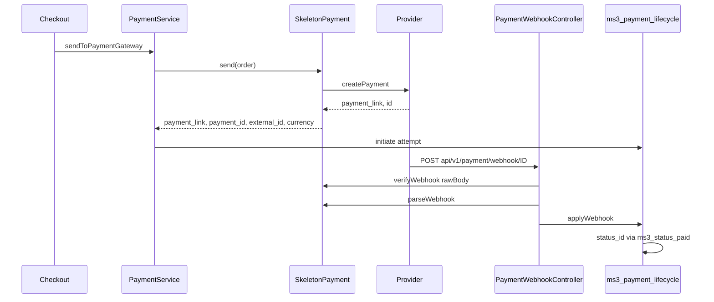

# Архитектура

## Слои

| Слой | Кто пишет | Роль |
|---|---|---|
| `Api/*` | вы | HTTP, подпись, разбор webhook |
| `SkeletonPayment` | вы в `buildPaymentRequest` | контракт MS3 |
| `WebhookHandler` | образец | один URL кабинета |
| `ms3_payment_lifecycle` | ядро | попытки и статус заказа |
| Процессоры вкладки | образец | возврат, отмена, синк |

Handler создаёт `PaymentService::loadPaymentHandler`, не `new $class` снаружи ядра.

## Попытка

`send()` обязан вернуть `payment_link`, `payment_id`/`external_id`, `currency`. Иначе строка в `ms3_payment_attempts` не появится. В payload события нельзя класть ключи из `BLOCKED_PAYLOAD_KEYS` (`secret`, `token`, `api_key` и остальные). `WebhookParser::safePayload()` их срезает.
